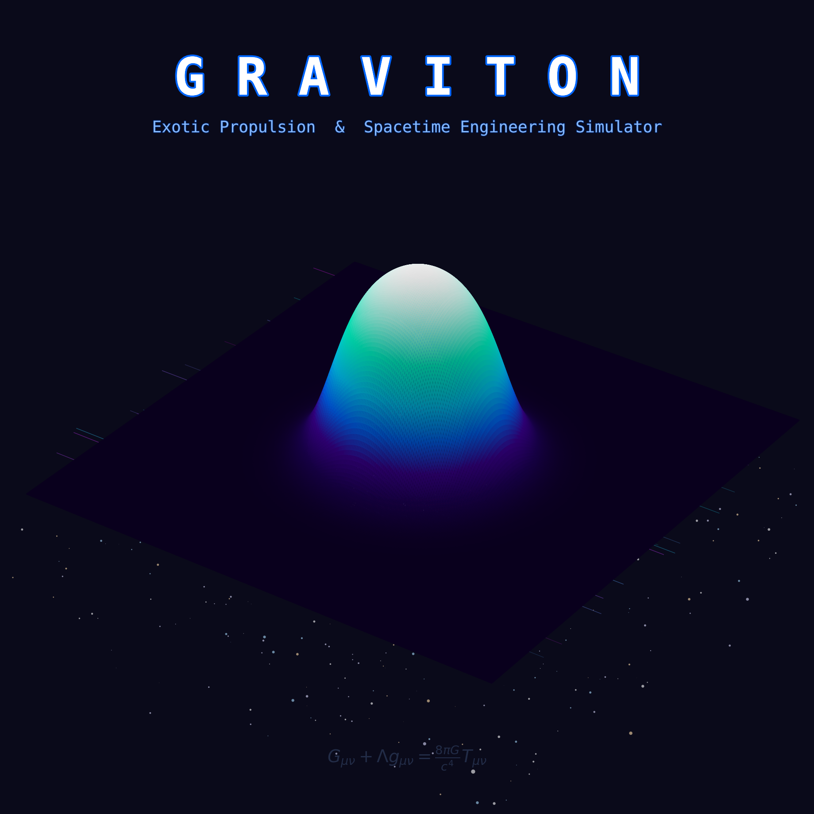

<p align="center">
  
</p>

# GRAVITON

### Exotic Propulsion & Spacetime Engineering Simulator

**GRAVITON** is a production-grade Python framework for simulating exotic propulsion concepts and spacetime engineering phenomena grounded entirely in peer-reviewed physics from General Relativity, quantum field theory, and gravitoelectromagnetism.

Every equation in this repository comes from a real, published, citable source. This is not science fiction code. This is theoretical physics taken to its engineering limits -- simulating what the math actually permits, even when the engineering is beyond current technology.

---

## Modules

| Module | Description | Key Reference |
|---|---|---|
| **`alcubierre/`** | Alcubierre warp drive metric, exotic energy, bubble dynamics | Alcubierre (1994) |
| **`gravitomagnetic/`** | GEM field equations, Lense-Thirring frame dragging | Mashhoon (2008) |
| **`zpe/`** | Casimir effect, quantum vacuum energy, exotic matter | Casimir (1948) |
| **`geodesic/`** | Geodesic solver for Schwarzschild and Kerr spacetimes | Schwarzschild (1916), Kerr (1963) |
| **`simulation/`** | Unified runner and Rich terminal dashboard | -- |

---

## Quick Start

```bash
# Clone
git clone https://github.com/YOUR_USERNAME/GRAVITON.git
cd GRAVITON

# Install dependencies
pip install -r requirements.txt

# Run the Alcubierre warp drive simulation
python examples/run_alcubierre.py --velocity 10 --radius 100 --sigma 8

# Run all simulations
python examples/run_all.py

# Run tests
python -m pytest tests/ -v
```

---

## Examples

```bash
# Alcubierre warp drive with interactive 3D Plotly visualizations
python examples/run_alcubierre.py --velocity 10 --radius 100 --sigma 8

# Earth's gravitomagnetic field and Lense-Thirring frame dragging
python examples/run_gravitomagnetic.py

# Casimir effect and zero-point energy
python examples/run_zpe.py

# Geodesic orbits around black holes
python examples/run_geodesic.py
```

---

## Tech Stack

- **Python 3.10+**
- **NumPy / SciPy** -- numerical computation and ODE integration
- **SymPy** -- symbolic tensor mathematics
- **Matplotlib** -- 2D field plots and animations
- **Plotly** -- interactive 3D spacetime geometry
- **Rich** -- terminal dashboard
- **Pytest** -- test suite

---

## Physics References

1. Alcubierre, M. (1994). "The warp drive: hyper-fast travel within general relativity." *Class. Quantum Grav.* 11, L73.
2. Pfenning, M.J. & Ford, L.H. (1997). "The unphysical nature of warp drive." *Class. Quantum Grav.* 14, 1743.
3. Hiscock, W.A. (1997). "Quantum effects in the Alcubierre warp drive spacetime." *Class. Quantum Grav.* 14, L183.
4. Mashhoon, B. (2008). "Gravitoelectromagnetism: A Brief Review." arXiv:gr-qc/0311030.
5. Lense, J. & Thirring, H. (1918). "On the influence of the proper rotation of central bodies on the motions of planets and moons." *Phys. Z.* 19, 156.
6. Casimir, H.B.G. (1948). "On the attraction between two perfectly conducting plates." *Proc. Kon. Ned. Akad. Wetensch.* 51, 793.
7. Ford, L.H. & Roman, T.A. (1995). "Averaged energy conditions and quantum inequalities." *Phys. Rev. D* 51, 4277.
8. Schwarzschild, K. (1916). *Sitzungsber. Preuss. Akad. Wiss. Berlin*, 189.
9. Kerr, R.P. (1963). "Gravitational field of a spinning mass." *Phys. Rev. Lett.* 11, 237.
10. Misner, C.W., Thorne, K.S. & Wheeler, J.A. (1973). *Gravitation*. W.H. Freeman.

---

## Project Structure

```
GRAVITON/
├── graviton/            # Core: constants, base class
├── alcubierre/          # Alcubierre warp drive
├── gravitomagnetic/     # GEM fields, frame dragging
├── zpe/                 # Zero-point energy, Casimir effect
├── geodesic/            # Geodesic solvers (Schwarzschild, Kerr)
├── simulation/          # Unified runner, dashboard
├── examples/            # Runnable demo scripts
├── tests/               # Pytest test suite
├── docs/                # Physics documentation
└── .github/workflows/   # CI/CD
```

---

## Testing

```bash
python -m pytest tests/ -v
```

All physics modules include tests verifying:
- Correct signs (negative exotic energy, attractive Casimir force)
- Scaling laws (1/d^4 Casimir, 1/r^3 frame dragging)
- Conservation laws (spin magnitude, energy)
- Limiting cases (flat spacetime, Kerr -> Schwarzschild at a=0)
- Known experimental values (surface gravity, Lamoreaux measurement)

---

## License

MIT License. See [LICENSE](LICENSE).

---

## Disclaimer

See [DISCLAIMER.md](DISCLAIMER.md). GRAVITON is a theoretical physics simulation tool. The exotic propulsion concepts simulated here require exotic matter with negative energy density, which has not been produced in macroscopic quantities. This software makes no claims about engineering feasibility.
